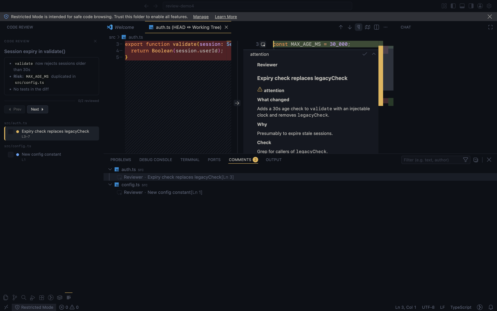

<p align="center">
  
</p>

<h1 align="center">Code Review</h1>

<p align="center">
  <strong>Review agent-written code the way you review a pull request: side-by-side diff, one note per change, no narration.</strong>
</p>

<p align="center">
  A coding-agent skill plus a VS Code / Cursor extension. After your agent edits code, <code>/review</code> opens each changed file in VS Code's side-by-side diff editor with a GitHub-style review note on every hunk: what changed, why, what to check. You read there and talk to the agent in chat as usual; it knows which hunk you are looking at.
</p>

<p align="center">
  
</p>

<p align="center"><em>Forked from <a href="https://github.com/Royal-lobster/code-explainer">Royal-lobster/code-explainer</a>. The walkthrough, TTS and podcast modes were removed in favour of a reading-first review flow.</em></p>

---

## Features

- **Side-by-side diff** — Uses VS Code's native diff editor, `HEAD` on the left and the working tree on the right. New and deleted files included. The right side is the real file, so you can edit while you review. On the first review the extension offers to pin side-by-side rendering, since VS Code otherwise switches to an inline diff in narrow editors.
- **One note per change** — A read-only GitHub-style comment anchored to each hunk with fixed fields: **what changed**, **why**, **check**. Tagged `info`, `attention`, or `risk`. No reply box: conversation stays in chat.
- **Reads like a pull request** — Hunks come straight from git, in file order, top to bottom, with exact line ranges computed by the extension. The agent only writes the words. `Ctrl+Shift+]` steps through and marks the hunk reviewed.
- **Chat knows where you are** — Say "why 30 seconds?" or "fix that" in your agent's chat. It reads the current hunk from the extension, answers in chat, and after a fix the note in the diff shows a one-line fixed mark.
- **Fast** — Small diffs are annotated directly by the agent that already has the diff, no sub-agent, no tooling runs. Diffs over 400 lines go to a Sonnet sub-agent that reads only the diff and is capped at three extra file reads.
- **Minimal sidebar** — Change-set summary, progress, and a per-file hunk list with severity dots and reviewed checkboxes.

## Requirements

- macOS or Linux with `git`
- Node.js 18+
- VS Code or Cursor with the CLI enabled (`code` or `cursor` command)
- `jq` (the skill validates review JSON with it) and `python3` (for `review.sh resolve`)

## Installation

Tell your coding agent:

```
Install the code review skill from https://github.com/SidharthK2/code-explainer
```

<details>
<summary>Manual installation</summary>

### For a team

Commit the skill into your repo so everyone who opens it with Claude Code has `/review` without installing anything:

```bash
git submodule add https://github.com/SidharthK2/code-explainer.git .claude/skills/review
.claude/skills/review/setup.sh     # each person, once, for the extension
```

Then edit the `~/.claude/skills/review/` paths in `SKILL.md` to `.claude/skills/review/`, or symlink one to the other.

### Skill-native agents

| Agent | Install command |
|-------|-----------------|
| **Claude Code** | `git clone https://github.com/SidharthK2/code-explainer.git ~/.claude/skills/review` |
| **Codex CLI** | `git clone https://github.com/SidharthK2/code-explainer.git ~/.codex/skills/review` |
| **OpenCode** | `git clone https://github.com/SidharthK2/code-explainer.git ~/.config/opencode/skills/review` |
| **Amp** | `git clone https://github.com/SidharthK2/code-explainer.git ~/.config/agents/skills/review` |

Then:

```bash
<SKILLS_DIR>/review/setup.sh
# Reload your editor: Cmd+Shift+P → "Developer: Reload Window"
```

### Rule-based agents

Clone anywhere, run `setup.sh`, then point the agent's rules at `SKILL.md` (Cursor `.cursor/rules/review.mdc`, Windsurf global rules, Kilo `~/.kilocode/rules/review.md`, Roo `~/.roo/rules/review.md`, Cline `.clinerules/review.md`). `SKILL.md` references `docs/` and `scripts/` by path, so keep the full repo where you cloned it and adjust the `~/.claude/skills/review/...` paths inside it.

### What setup.sh does

- Checks git, Node.js, editor CLI, `jq`, `python3`
- Non-interactive. `./setup.sh --model opus` changes the `REVIEWER` model used for large diffs (default `sonnet`)
- Builds the extension and installs the `.vsix` into every detected editor

</details>

## Usage

After your agent has made changes:

```
/review
```

or naturally: "review what you just changed", "check the diff before I commit".

What happens:

1. The extension computes the hunks from git (working tree vs `HEAD`, or vs the merge-base for `/review main`), untracked files included.
2. The agent writes one note per hunk as JSON, itself for small diffs or via a `REVIEWER` sub-agent for large ones. Scratch files can be skipped.
3. The extension opens the first file's diff, anchors a note to each hunk, and shows the summary in the sidebar. The agent returns control to you.
4. You step through in VS Code. Questions and fix requests go in chat; the agent knows the hunk you are on. Fixed hunks get a one-line mark in the diff.
5. Say "done" and the agent closes the review with a short wrap-up.

The repo does not need to be open in VS Code beforehand: if no window serves it, the helper opens one. If VS Code cannot be reached at all, the agent prints the review as text in the terminal instead.

### In the diff

| Shortcut | Action |
|----------|--------|
| `Ctrl+Shift+]` | Next hunk (marks current reviewed) |
| `Ctrl+Shift+[` | Previous hunk |
| `Ctrl+Shift+\` | Close review |

Each note has a check icon to toggle reviewed. Sidebar: click a hunk to jump, click its checkbox to toggle reviewed.

### Reviewer notes

Each thread has the same shape:

| Field | Content |
|-------|---------|
| Title + severity | 3–8 words; `info`, `attention`, or `risk` |
| **What changed** | Behavior, not syntax |
| **Why** | Inferred intent, hedged when it is a guess |
| **Check** | A concrete thing for you to verify, or empty |

## Architecture

```
Coding Agent ──HTTP──▶ Extension Server ──▶ Review state ──▶ Diff editor + comment threads
      ▲                                           │
      └──── GET /api/state (which hunk is the user on?)     Sidebar webview
```

| Component | File | Role |
|-----------|------|------|
| Skill | `SKILL.md`, `docs/reviewer.md` | Agent checklist and the reviewer sub-agent prompt |
| Helper | `scripts/review.sh` | CLI over the HTTP API: `diff`, `review`, `state`, `resolve`, `goto`, `close` |
| Hunks | `src/gitdiff.ts` | Runs and parses `git diff`, computes exact new-side ranges, includes untracked files |
| Server | `src/server.ts` | HTTP + WebSocket on localhost with bearer token, schema validation |
| Review state | `src/review.ts` | Hunks, current position, reviewed / flagged / resolved per hunk |
| Diff | `src/diff.ts` | `HEAD` content provider and `vscode.diff` opening with the hunk revealed |
| Threads | `src/comments.ts` | Comment controller: read-only reviewer note plus fix mark |
| Sidebar | `src/sidebar.ts`, `media/sidebar.*` | Summary, progress, hunk list |

The full message schema is in [`docs/protocol.md`](docs/protocol.md).

## Project structure

```
code-explainer/
├── SKILL.md                     # /review skill instructions
├── setup.sh                     # Build + install the extension
├── scripts/
│   ├── review.sh                # HTTP API helper for the agent
│   └── reinstall-extension.sh   # Quick rebuild
├── docs/
│   ├── reviewer.md              # Reviewer sub-agent prompt
│   ├── protocol.md              # Message schema
│   ├── setup.md
│   └── uninstall.md
└── vscode-extension/
    ├── package.json
    ├── src/
    │   ├── extension.ts         # Wiring: events, commands, agent messages
    │   ├── server.ts            # HTTP + WS server
    │   ├── review.ts            # Review state machine
    │   ├── gitdiff.ts           # git diff parsing, hunk ranges
│   ├── diff.ts              # Base content provider, open diff editor
    │   ├── comments.ts          # Comment threads
    │   ├── highlight.ts         # Active-hunk decoration
    │   ├── sidebar.ts           # Webview provider
    │   └── types.ts             # Protocol types
    └── media/
        ├── icon.svg / icon.png
        ├── sidebar.js
        └── sidebar.css
```

## License

MIT
